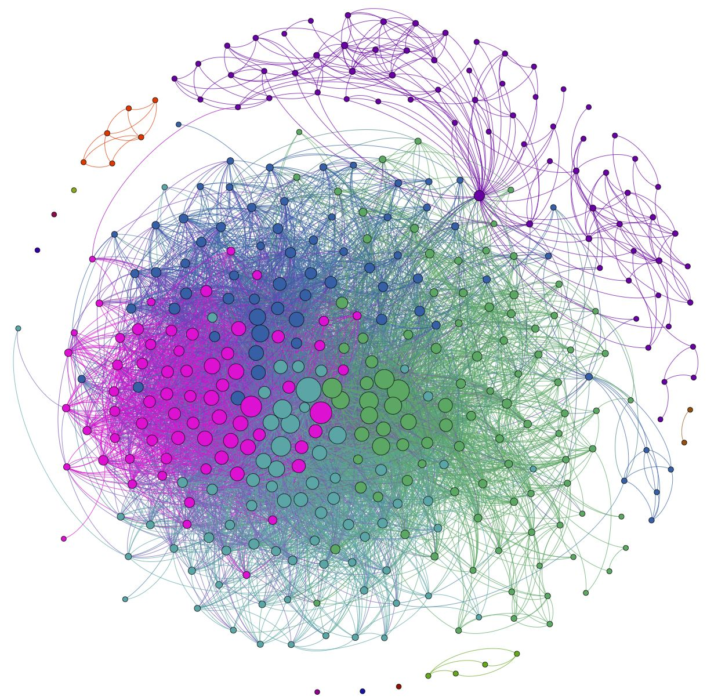
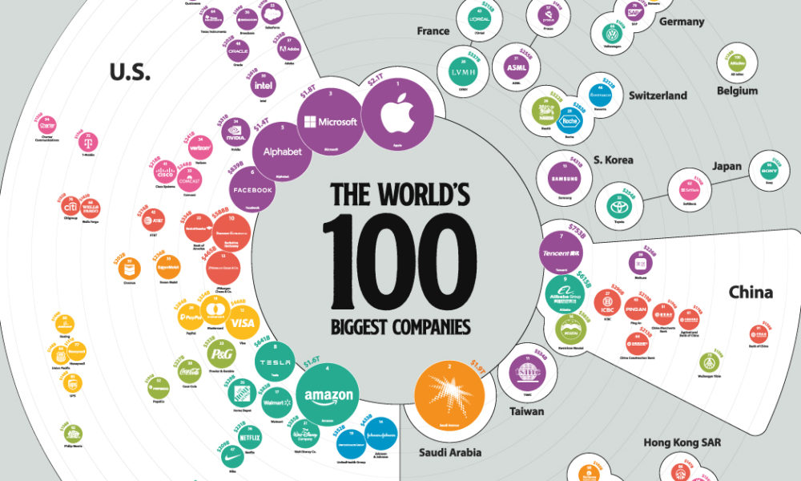
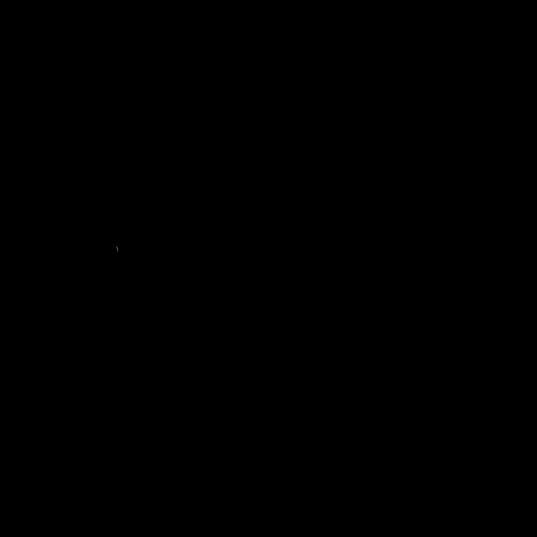
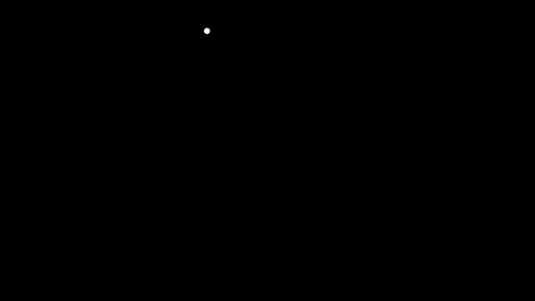
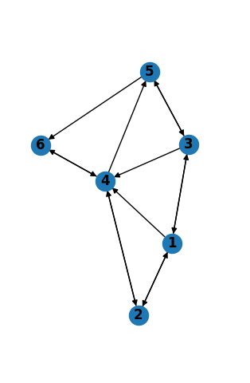
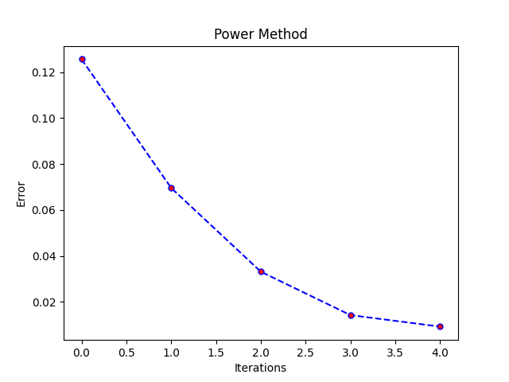
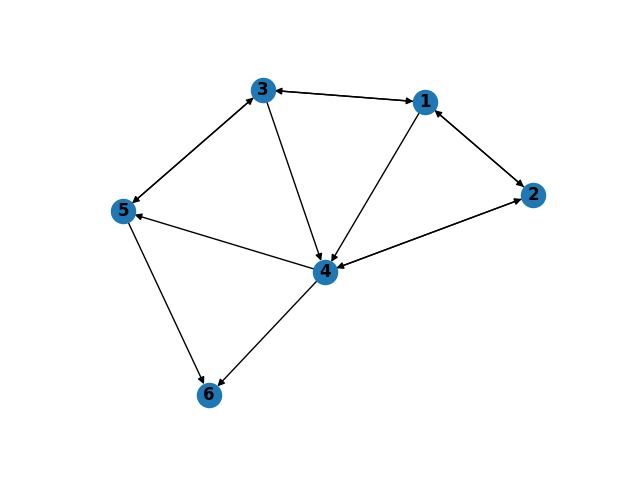
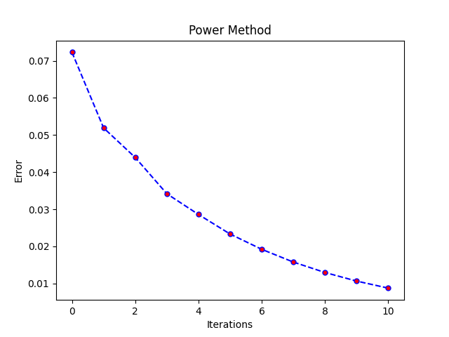
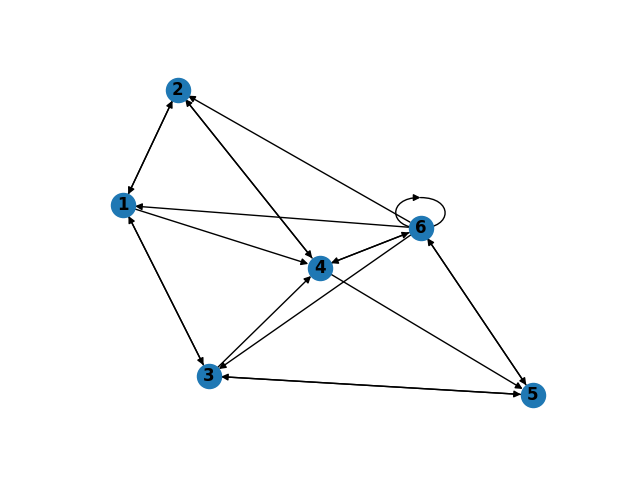
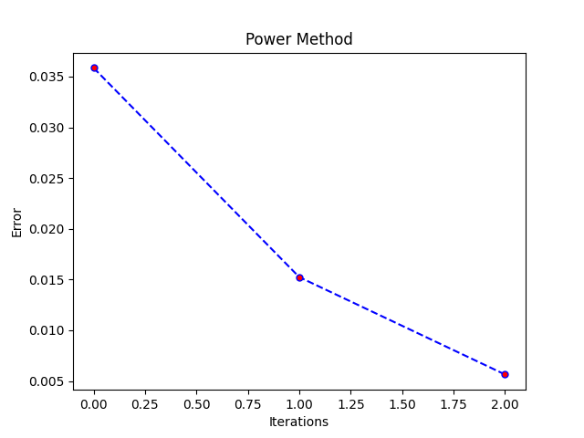

<!-- _class: invert -->

# Google Page Rank
## Tata Satya Pratheek, 1811171
## M455 Presentation  
### 28th April 2022

---
<!-- _class: invert -->
# Introduction

- Google Inc. began in August 1998 as a search engine.
- Quickly became the most popular search engine in the world and now a tech empire under Alphabet Inc.

---
<!-- _class: invert -->
# Search Results

Two factors determine where Google displays a web page:
- The page's rank.
Higher Rank = Larger number of pages linking to it.
- Hypertext Analysis.
Based on text, fonts, subdivisions, location of words, contents of neighbouring pages, etc.

---
<!-- _class: invert -->
# PageRank, properties.
> PageRank is a measure of the importance of a web page. 
     [Brin and Page, 1998]
1. Assigns a rank to every web page.
2. Influences the order in which Google displays search results.
3. Based on link structure of the web graph.
4. Does not depend on content of web pages.
5. Does not depend on the search query.
> Larger PageRank $\rightarrow$ Larger importantance $\rightarrow$ More visitors $\rightarrow$ More ad revenue.

---
<!-- _class: invert -->
# Impact of PageRank

Brin and Page, patented  PageRank in 1998 but never renewed it.
- continues to provide the basis for all Google's search tools.
- exploiting links in web graph as currency.
- leads to backlink obsession and search engine optimization (SEO).

---
<!-- _class: invert -->
# Web graph
$G$ forms a webgraph by connecting web pages by links. Here the vertices are web pages and the edges are links.

---
<!-- _class: invert -->
# Web graph, continued
A short animation of how the web graph could be formed.

---
<!-- _class: invert -->
# Example

Consider the graph on the right with the following adjacency matrix, $A$:
> $A=\left[\begin{array}{llllll}0 & 1 & 1 & 1 & 0 & 0 \\ 1 & 0 & 0 & 1 & 0 & 0 \\ 1 & 0 & 0 & 1 & 1 & 0 \\ 0 & 1 & 0 & 0 & 1 & 1 \\ 0 & 0 & 1 & 0 & 0 & 1 \\ 0 & 0 & 0 & 1 & 0 & 0\end{array}\right]$

---
<!-- _class: invert -->
# Example, continued
We create a new matrix whose elements are given by:
> $S_{i j}=\left\{\begin{array}{cc}1 / l_{p_{j}} & \text { If } p_{j} \text { links to } p_{i} \\ 0 & \text { otherwise }\end{array}\right.$

where $l_{p_j}$ is the number of outgoing links from page $p_j$ giving us 

>$S=\left[\begin{array}{cccccc}0 & 1 / 3 & 1 / 3 & 1 / 3 & 0 & 0 \\ 1 / 2 & 0 & 0 & 1 / 2 & 0 & 0 \\ 1 / 3 & 0 & 0 & 1 / 3 & 1 / 3 & 0 \\ 0 & 1 / 3 & 0 & 0 & 1 / 3 & 1 / 3 \\ 0 & 0 & 1 / 2 & 0 & 0 & 1 / 2 \\ 0 & 0 & 0 & 1 & 0 & 0\end{array}\right]$

We see that S is a row stochastic matrix.

---
<!-- _class: invert -->
# Example, continued

The eigenvalues of $S$ are
> $\lambda_1 = 1, \lambda_2 = \frac{1}{3}, \lambda_3 = \frac{-1-\sqrt{7}}{6}, \lambda_4 = \frac{-1+\sqrt{7}}{6}$.

The corresponding eigenvectors are 
> $v_{1}=\left[\begin{array}{l}1 \\ 1 \\ 1 \\ 1 \\ 1 \\ 1\end{array}\right] \quad v_{2}=\left[\begin{array}{c}\frac{-17}{9} \\ \frac{-7}{3} \\ \frac{1}{9} \\ \frac{1}{3} \\ \frac{5}{3} \\ 1\end{array}\right] v_{3}=\left[\begin{array}{c}\frac{\sqrt{7}+1}{3} \\ -1 \\ \frac{-\sqrt{7}-1}{3} \\ 0 \\ 1 \\ 0\end{array}\right] v_{4}=\left[\begin{array}{c}\frac{-\sqrt{7}+1}{3} \\ -1 \\ \frac{\sqrt{7}-1}{3} \\ 0 \\ 1 \\ 0\end{array}\right]$

The dominant eigenvalue is $\lambda_1$ and the corresponding eigenvector $v_{1}$ is dominant.

---
<!-- _class: invert -->
# Internet Network Matrix

Given a web graph with $n$ nodes, we can create a $n \times n$ row stochastic matrix $S$, by defining 
> $S_{ij}=Pr(X_t=p_j|X_{t-1}=p_i)$.
The dominant eigenvalue of S is $\lambda_1 = 1$.

Given $S$, we have a unique stationary distribution vector $\pi$ which is the solution of 
> $\pi ^T S = \pi^T, \quad \pi \geq \mathbf{0}, \quad \pi^T \mathbf{e}=1, \quad \mathbf{e} = (1\;1\;...\;1)$. 
Hence $\pi$ is the dominant left eigenvector of S corresponding to $\lambda_1$.

$\pi_i$ represents the probability of being on $p_i$.

---
<!-- _class: invert -->
# PageRank
Given a page A, its PageRank denoted by PR(A) is given by
> $PR(A) = (1-d)+d[\frac{PR(T_1)}{L(T_1)} +\frac{PR(T_2)}{L(T_2)},\ldots+ \frac{PR(T_n)}{L(T_n)}]$

where:
- $d$ is the damping factor
- $T_i$ is the $i^{th}$ outgoing link from page A
- $L(T_i)$ is the number of outgoing links from page A.

It is meant to simulate the number of links that a random surfer would follow before the go to a random unlinked page.

---
<!-- _class: invert -->
# PageRank, continued
Given $N$ many pages, we see that the previous definition does not form a probability distribution. We get it by the modified definition:
> $PR(a_i) = \frac{(1-d)}{N} +d\sum_{a_j \in \mathcal{N}(a_i)} \frac{PR(a_j)}{L(a_j)}$

where:
- $\mathcal{N}(a_i)$ is the set of pages that link to page $a_i$

---
<!-- _class: invert -->
# Power Method
- Given: Row Stochastic Matrix $S$
- To Find: $\pi$ such that $\pi^T S = \pi^T$
- Solution: 
 Choose an initial guess $x^{(0)}$ and error threshold, $\alpha$.
 Repeat $[x^{(k+1)}]^T = [x^{(k)}]^T S$ till $||[x^{(k+1)}]^T - [x^{(k)}]^T|| < \alpha$.

---
<!-- _class: invert -->
# Power Method, example

For the model internet with adjacency matrix $A$ and row stochastic matrix $S$, we start with $x^{(0)} = \frac{1}{6}\mathbf{e}$ and $\alpha = 0.01$ to get 
> $\pi=\left[\begin{array}{l}0.11 \\ 0.14 \\ 0.11 \\ 0.32 \\ 0.14 \\ 0.18\end{array}\right]$ and $\sum_k \pi_k = 1$.

---
<!-- _class: invert -->
# Dangling Nodes

Sometimes, we have a graph with dangling nodes which don't link to any page. 
The stochastic matrix $S=\left[\begin{array}{cccccc}0 & 1 / 3 & 1 / 3 & 1 / 3 & 0 & 0 \\ 1 / 2 & 0 & 0 & 1 / 2 & 0 & 0 \\ 1 / 3 & 0 & 0 & 1 / 3 & 1 / 3 & 0 \\ 0 & 1 / 3 & 0 & 0 & 1 / 3 & 1 / 3 \\ 0 & 0 & 1 / 2 & 0 & 0 & 1 / 2 \\ 0 & 0 & 0 & 0 & 0 & 0\end{array}\right]$

---
<!-- _class: invert -->
# Dangling Nodes, continued

If we start with $x^{(0)} = \frac{1}{6}\mathbf{e}$ and $\alpha = 0.01$, we get 
> $\pi=\left[\begin{array}{l}0.01 \\ 0.04 \\ 0.01 \\ 0.02 \\ 0.01 \\ 0.02\end{array}\right]$ and $\sum_k \pi_k = 0.11$.

---
<!-- _class: invert -->
# Dangling Nodes, continued

The authors remove dangling nodes before calculating PageRank in their follow up paper. Other fixes exist, the simplest one is where the dangling node is linked to every other page in the network.

---
<!-- _class: invert -->
# Dangling Nodes, continued

If we take 
- $D_{i}=\left\{\begin{array}{c}1  & \text { If }  i^{th} \text { node is not dangling } p_{i} \\ 0 & \text { otherwise }\end{array}\right.$ and 
- $w = \left(\frac{1}{N} \; \frac{1}{N} \; ... \; \frac{1}{N}\right)$

We then have the new stochastic matrix 
> $M = S + Dw$ 

---
<!-- _class: invert -->
# Dangling Nodes, continued
Continuing with the same initial conditions as before, we get
> $\tilde{\pi} = \left[\begin{array}{l}0.16 \\ 0.15 \\ 0.16 \\ 0.21 \\ 0.15 \\ 0.17\end{array}\right]$ and $\sum_k \pi_k = 1$.

---
<!-- _class: invert -->
# Google matrix
In order to include the case of dangling nodes, Wills et al. (2007) proposed the Google matrix $G$ defined as:
> $G = dM+(1-d)\mathbf{e}\mathbf{v}$

Then for a suitable starting vector $r^{(0)}$ and $\alpha$ we get, 
> $[r^{(k)}]^T = [r^{(k-1)}]^T (d(H + Dw) + (1-d)\mathbf{e}\mathbf{v})$
$= d[r^{(k-1)}]^T + d([r^{(k-1)}]^TD)w + (1-d)\mathbf{v}$

which is easier for very large number of pages.

---
<!-- _class: invert -->
# Kendall's $\tau$ correlation coefficient
Instead of using the power method till convergence, we find a good enough ranking and then use Kendall's $\tau$ coefficient to provide an easier PageRank. 

The Kendall's $\tau$ correlation coefficient is a measure of the similarity between two rankings.

$\tau$ is defined as 
> $\tau = \frac{1-2s}{\frac{1}{2}n(n-1)}$

where Kendall's distance $s$ is the number of different elements in the lists of ordered pairs in two rankings of n items.

---
<!-- _class: invert -->
# Combating Manipulation
PageRank manipulation could easily attract spammers who insert large numbers of links to point to a page to artificially inflate its PageRank. 

- Haveliwala and Kamvar (2003) have showed that the second eigenvalue of the Google matrix equals the damping number and the corresponding eigenvectors are associated with subgraphs of web graph which may have incoming edges but no outgoing edges. This also speeds up the computation of PageRank.
- Sangers and van Gijzen (2015) build on Haveliwala and Kamvar's work by studying the relation between the second eigenvalue of the Google matrix and irreducible closed sets.

---
<!-- _class: invert -->
# PageRank in the real world
1. PageRank algorithm has been most extensively used in citation networks which measures a researcher's productivity.
2. PageRank has been used to rank NFL teams accurately.
3. PageRank algorithm applied on the food web graph can measure relative importance of different species for co-extintion.
4. PageRank algorithm on a metabolic graph can give us information about protein interaction networks.

---
<!-- _class: invert -->
# Thank You

---
<!-- _class: invert -->
# References
1. [PageRank Overview](https://www.semrush.com/blog/pagerank/)
2. [The anatomy of a large-scale hypertextual Web search engine](https://snap.stanford.edu/class/cs224w-readings/Brin98Anatomy.pdf)
3. [The Mathematics Behind Google’s PageRank](https://ipsen.math.ncsu.edu/ps/slides_man.pdf)
4. [MATHEMATICS BEHIND GOOGLE’S PAGERANK ALGORITHM](https://twu-ir.tdl.org/bitstream/handle/11274/10796/MOOR-THESIS-2018.pdf?sequence=1&isAllowed=y)
5. [Google PageRank](https://www.amsi.org.au/teacher_modules/pdfs/Maths_delivers/Pagerank5.pdf)
